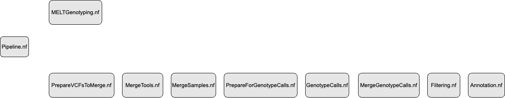

# Structural Variant Calling pipeline for short reads

## Description

Pipelines to identify high-confidence structural variants using NGS data. The pipelines uses seven different structural variant calling tools and build consensus for different structural variant types. The structural variant types include insertion, deletion, duplication, inversion and translocations. The consensus is built based on the variants identified as same SV type by at least two SV calling tools. The SV calling pipeline are Nextflow adaptation of the SV discovery pipeline availabe [here](https://github.com/RajLabMSSM/AMP_AD_StructuralVariation/tree/main/analysis/pipeline) ([Ricardo et al. 2021](https://www.medrxiv.org/content/10.1101/2021.02.25.21252245v1)).

## Prerequistes

### Tools

1. [Delly](https://github.com/dellytools/delly)
2. [Lumpy](https://github.com/arq5x/lumpy-sv)
3. [Manta](https://github.com/Illumina/manta)
4. [BreakDancer](https://github.com/genome/breakdancer) ([SVE](https://github.com/TheJacksonLaboratory/SVE))
5. [BreakSeq](http://bioinform.github.io/breakseq2/) ([SVE](https://github.com/TheJacksonLaboratory/SVE))
6. [CNVnator](https://github.com/abyzovlab/CNVnator) ([SVE](https://github.com/TheJacksonLaboratory/SVE))
7. [MELT](https://melt.igs.umaryland.edu/)

Note: 

[SVE](https://github.com/TheJacksonLaboratory/SVE) is a wrapper for conveniently executing  [BreakDancer](https://github.com/genome/breakdancer), [BreakSeq](http://bioinform.github.io/breakseq2/) and [CNVnator](https://github.com/abyzovlab/CNVnator). 

Please make sure to update path/to/SVE/bin/tools.py file with the your location of path/to/SVE/src.


### R libraries

1. vcfR
2. bumphunter
3. dplyr
4. GenomicRanges
5. regioneR
6. splitstackshape
7. abind
8. reshape2


## Pipeline Execution Order
</br>
 
<br></br>

## Execute
1. Clone this repository to the directory where you will run the pipeline:
   ```
   git clone https://github.com/CERC-Genomic-Medicine/ExomePlus.git
   ```
2. Traverse to the folder `StructuralVariantCalling`

3. Modify `nextflow.config` configuration file:
    * `params.inputFiles` -- path to the input files for Pipeline.nf (can use wildcard expressions to select files)
    * `params.inputFileType` -- input file type (bam or cram).
    * `params.doCramToBam` -- set true to convert cram files to bam files
    * `params.bamsFolder` --  path to bams folder // folder to write cram to bam files (for bam type files same as inputFiles folder)
    * `params.result` -- path to result folder
    * `params.referenceDir` -- path to referenceGenome folder
    * `params.referenceGenome`-- path to referenceGenome file (*.fa)
    * `params.genome` --  "hg38" (or hg19)
    * `params.scripts` -- "./Scripts"
    * `params.delly` --  path to delly_v0.9
    * `params.manta` --  path to manta bin folder
    * `params.sve` --  path to SVE
    * `params.lumpy` --  path to lumpy-sv
    * `params.melt` --  path to MELT
    * `params.mei` --  path to MELT/me_refs/Hg38
    * `params.survivor` -- path to SURVIVOR/Debug/SURVIVOR
    * `params.smoove` --  path to smoove
    * `params.annotsv` --  path to AnnotSV/bin/AnnotSV
    * `params.breakpoint_dist` -- Breakpoint distance (default 1000) 
    * `params.use_type` -- Use SV type (0 = False, 1 = True) (default 1)
    * `params.use_strand` -- Use strand information (0 = False, 1 = True) (default 1)
    * `params.dist_based` -- Use distance based for merging (0 = False, 1 = True) (default 0)
    * `params.min_sv_size` -- Minimum SV size (default 50)


4. Run pipeline (Interactive SLURM job, choose the pipeline to run in the order described in the above figure):
    ```
    salloc --time=12:00:00 --ntasks=1 --mem-per-cpu=16G
    module load nextflow
    nextflow run Pipeline.nf
    ```
5. Run pipeline (sbatch job):
    ```
    sbatch sbatch_job.sh
    ```